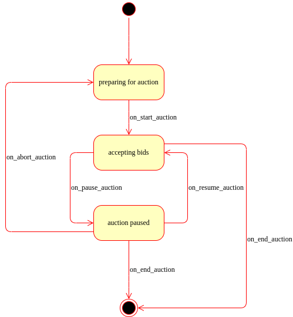

Модель онлайн-аукциона (вариант 73)

Предметная область: интернет-торговля с использованием аукционных площадок.

Важные сущности: лот, участник аукциона, ставка, торговая площадка, таймер.

Операции: операция размещения лота, операция участия в торгах, операция управления ставками, операция завершения аукциона, операция оформления победы и платежей.

У класса TradingPlatform есть три состояния `preparing_for_auction`, `accepting_bids`, `auction_paused` возможные переходы 

```
self.machine.add_transition(trigger='on_start_auction', source='preparing_for_auction', dest='accepting_bids')
self.machine.add_transition(trigger='on_end_auction', source='accepting_bids', dest='preparing_for_auction')
self.machine.add_transition(trigger='on_pause_auction', source='accepting_bids', dest='auction_paused')
self.machine.add_transition(trigger='on_resume_auction', source='auction_paused', dest='accepting_bids')
self.machine.add_transition(trigger='on_restart_auction', source='auction_paused', dest='accepting_bids')
self.machine.add_transition(trigger='on_abort_auction', source='auction_paused', dest='preparing_for_auction')
```

Возможные действия во время каждого из состояний:
- `preparing_for_auction`:
  - добавление/удаление участника/лота
  - просмотр списка участников/лотов
  - смена баланса участника
  - смена времени таймера
- `accepting_new_bid`
  - принятие новой ставки (если не принято ни одной ставки до истечения таймера, то передача лота победителю аукциона и списание средств с победителя)

При запуске программы начальное состояние `preparing_for_auction`.

Сохранение состояния программы:
  - сохранение происходит автоматически при изменении значения атрибутов классов
  - если текущее состояние `preparing_for_auction`, то сохраняются значения всех классов
  - иначе (в состоянии `accepting_bids`) сохраняется состояние на момент до начала принятия ставок

## Основные сущности

### Timer

`Timer` — это сущность для управления обратным отсчётом времени и автоматического выполнения заданной функции (callback) по истечении тайм-аута. Используется для контроля времени торгов, например, завершения приёма ставок на лот.

Основные возможности:

- Принимает значение тайм-аута (в секундах) и функцию, которую нужно вызвать по истечении времени.
- Может быть запущен и отменён.
- Гарантирует, что одновременно активен только один таймер: запуск нового таймера отменяет предыдущий.
- `Timer` необходим для автоматизации действий, зависящих от времени, в процессе проведения аукциона.


Основные методы:
- `start()`: запускает таймер. Если таймер уже запущен, он отменяется перед запуском нового.
- `cancel()`: отменяет текущий таймер, если он запущен.

Пример использования:
```python
timer = Timer(timeout=60, callback=on_auction_end)
timer.start()
# ...
timer.cancel()
```


### Lot

`Lot` — это сущность, представляющая лот на аукционе.

Основные возможности:
- Хранит информацию о названии, описании, минимальной ставке и уникальном идентификаторе лота.
- Гарантирует, что минимальная ставка не может быть отрицательной.
- Позволяет получить данные о лоте через свойства: имя, описание, минимальная ставка, идентификатор.
- Поддерживает преобразование в словарь и восстановление из словаря для сохранения состояния.

Основные методы и свойства:
- `name`: возвращает название лота.
- `description`: возвращает описание лота.
- `minimum_bid`: возвращает минимальную ставку для лота.
- `lot_id`: возвращает уникальный идентификатор лота.
- `_to_dict()`: возвращает словарь с данными лота.
- `_from_dict(data)`: создаёт объект лота из словаря.

Пример использования:
```python
lot = Lot(name="Картина", description="Авторская работа", minimum_bid=1000)
print(lot.name)
print(lot.minimum_bid)
```

### AuctionParticipant

`AuctionParticipant` — это сущность, представляющая участника аукциона.

Основные возможности:
- Хранит информацию о никнейме, балансе, уникальном идентификаторе и списке лотов, принадлежащих участнику.
- Позволяет изменять никнейм, баланс и список лотов.
- Гарантирует уникальность идентификатора для каждого участника.
- Поддерживает преобразование в словарь и восстановление из словаря для сохранения состояния.

Основные методы и свойства:
- `nickname`: возвращает или устанавливает никнейм участника.
- `balance`: возвращает или устанавливает баланс участника.
- `lots`: возвращает или устанавливает список лотов участника.
- `participant_id`: возвращает уникальный идентификатор участника.
- `_to_dict()`: возвращает словарь с данными участника.
- `_from_dict(data, lot_map)`: создаёт объект участника из словаря с использованием карты лотов.

Пример использования:
```python
participant = AuctionParticipant(nickname="Иван", balance=5000)
print(participant.nickname)
print(participant.balance)
participant.lots = [lot1, lot2]
```


### Bid

`Bid` — это сущность, представляющая ставку в аукционе.

Основные возможности:

- Хранит информацию о лоте (`Lot`), участнике (`AuctionParticipant`) и размере ставки.
- Проверяет корректность ставки: сумма не может быть меньше минимальной ставки лота и превышать баланс участника.
- Позволяет повысить ставку методом `increase_bid`, с дополнительной валидацией.

Основные методы и свойства:
- `increase_bid(new_amount, participant)`: увеличивает ставку, если новая сумма больше текущей и не превышает баланс участника.
- `lot`: возвращает лот, на который сделана ставка.
- `participant`: возвращает участника, сделавшего ставку.
- `amount`: возвращает текущую сумму ставки.

Пример использования:
```python
bid = Bid(lot=lot, amount=100, participant=participant)
bid.increase_bid(new_amount=150, participant=participant)
print(bid.amount)
```


### TradingPlatform

`TradingPlatform` — это сущность, представляющая торговую платформу для управления аукционом. Наследует логику конечного автомата (`StateMachine`) и реализует основные процессы проведения торгов.

Основные возможности:
- Управление состояниями аукциона: подготовка, приём ставок, пауза, завершение.
- Хранение и управление списками участников, лотов, проданных лотов.
- Проведение торгов: запуск, завершение, пауза, возобновление, отмена.
- Приём и обработка ставок с автоматической валидацией.
- Управление таймером для ограничения времени торгов по каждому лоту.
- Сохранение и восстановление состояния платформы из файла.

Основные методы и свойства:
- `start_auction()`: запускает аукцион, переводит платформу в состояние приёма ставок.
- `end_auction()`: завершает текущий аукцион, определяет победителя и переводит платформу в исходное состояние.
- `pause_auction()`, `resume_auction()`, `restart_auction()`, `abort_auction()`: управление паузой и отменой торгов.
- `add()`, `remove()`: добавление и удаление участников и лотов.
- `place_bid(participant, amount)`: приём новой ставки от участника.
- `participants`, `lots`, `sold_lots`: свойства для получения списков участников, лотов и проданных лотов.
- `timeout`: свойство для управления временем таймера (только в состоянии подготовки).
- `current_lot`, `current_bid`: свойства для получения текущего лота и ставки (только в процессе торгов).

Пример использования:
```python
participant1 = AuctionParticipant(nickname="Иван", balance=5000)
lot1 = Lot(name="Картина", description="Авторская работа", minimum_bid=1000)

platform = TradingPlatform()
platform.add(participant1, lot1)
platform.timeout = 90
platform.start_auction()
platform.place_bid(participant1, 1500)
platform.end_auction()
```

## Диаграмма классов


## Диаграмма состояний

