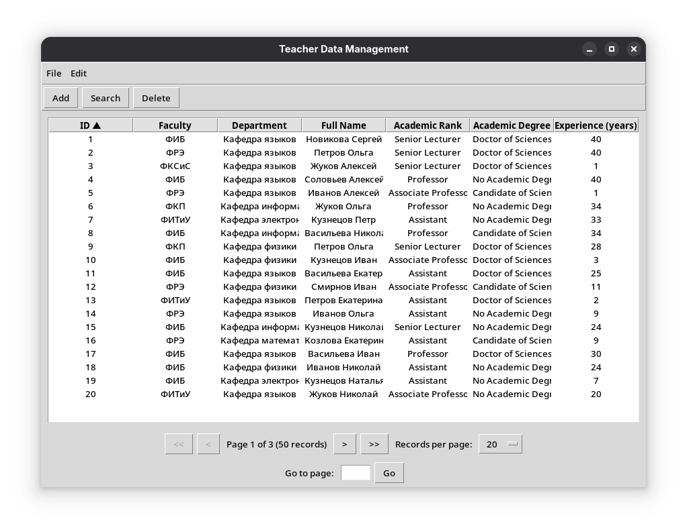

## Вариант 12

Поля таблицы:
- Факультет
- Название кафедры
- ФИО преподавателя
- Ученое звание
- Ученая степень
- Стаж работы

Условия поиска и удаления:
- по фамилии преподавателя или наименованию кафедры (может быть заполнен только один элемент ФИО, например имя);
- по ученому званию и факультету;
- по стажу работы (задается верхний и нижний предел);
Замечание: Список названий кафедр, список факультетов, список ученых степеней и званий в диалоге поиска, собирается системой и выводится в выпадающий список;

## Главное окно

Представление в форме таблицы

Представление в форме дерева

## Окно добавления

## Окно удаления

## Окно поиска

